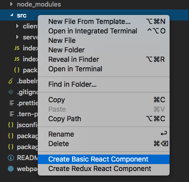
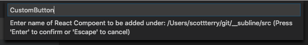

# react-explorer-addons

This extension adds context menu items for creating the directory structures and file templates for React Stateless and Redux connected Components.

## Features

Creates the following context menu items for directories in the EXPLORER pane in VSCode:

- Create Basic React Component
- Create Redux React Component



The extension will themn prompt you for the Component Name and will be injected into the React template.



The following directory structure will be created for:

### Create Basic React Component

```
- ComponentName
  - ComponentName.css
  - ComponentName.js
```

### Create Redux React Component

```
- ComponentName
  - actions.js
  - reducers.js
  - selectors.js
  - ComponentName.css
  - ComponentName.js
```

## Extension Settings

Include if your extension adds any VS Code settings through the `contributes.configuration` extension point.

For example:

This extension contributes the following settings:

* `myExtension.createBasicReactComponent`: Creates a basic React Component directory structure
* `myExtension.createReduxConnectedReactComponent`: set to `blah` to do something

## Known Issues

Not everyone uses the same React template format, so i realize the format used here is not entirely ideal for everyone. To resolve that I would like to add the ability to create your own templates in the future.

## Release Notes

Initial Release
